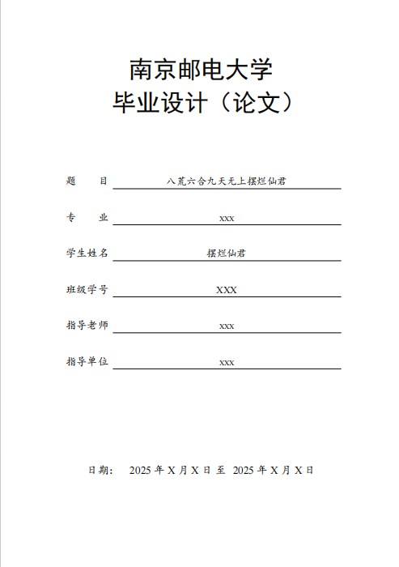
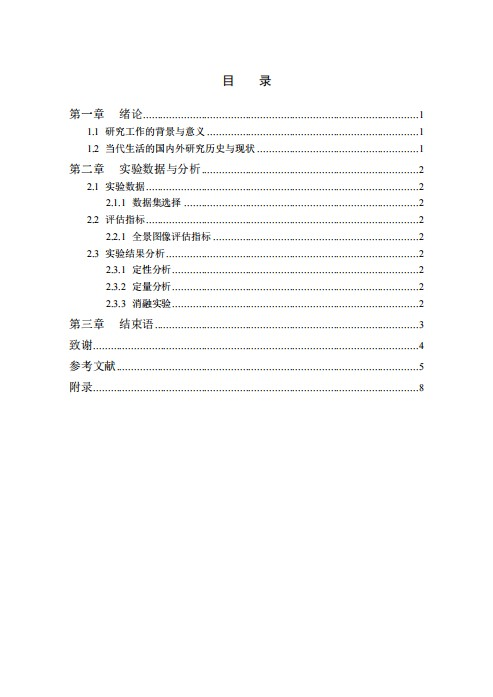
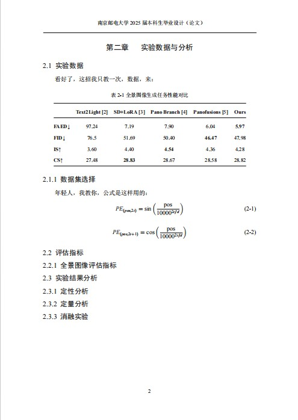

# 南京邮电大学毕业论文模板
## 毕业论文能达标就行，写完了有时间多回去看看家人
欢迎使用南京邮电大学毕业论文模板！该模板旨在帮助学生按照学校的要求和规范，高效、准确地撰写毕业论文，确保论文格式符合学术标准，方便论文的评审、存档以及后续的学术交流等活动。

## 使用方法

  1. **下载模板** ：点击 [Releases]([https://github.com/your-username/your-repo-name/releases](https://github.com/ace-trump-tech/NJUPT-Thesis/tree/main?tab=readme-ov-file)) 下载最新的模板文件压缩包。
  2. **解压文件** ：将下载的压缩包解压到本地文件夹中。
  3. **编辑论文** ：使用 LaTeX 编辑器（如 TeXworks、Overleaf 等）打开模板文件，按照文档中的注释和示例，替换内容以撰写你的论文。确保你已经安装了相应的 LaTeX 发行版（如 TeX Live 或 MiKTeX）。
  4. **安装依赖** ：如果遇到缺失宏包的提示，请根据提示安装所需宏包，或者在 TeX 发行版的包管理器中搜索并安装常用学术论文相关的宏包，如 hyperref、graphicx、biblatex 等。

## 文件结构

  * **thesis.tex** ：主论文文件，包含了论文的整体结构和内容框架，如封面、摘要、目录、正文、参考文献等部分。
  * **bibliography.bib** ：参考文献数据库文件，用于存储论文中引用的文献信息，按照特定的格式（如 BibTeX）编写，方便在论文中引用和生成参考文献列表。
  * **chapters/** ：存放论文各章节内容的独立文件夹，每个章节对应一个.tex 文件，便于对论文内容进行模块化管理和编辑，例如 chapter1.tex 为引言部分，chapter2.tex 为相关工作等。
  * **figures/** ：用于存放论文中涉及的图表文件，支持常见的图片格式，如 PDF、PNG、JPG 等，确保图表清晰、准确地展示相关数据和概念。
  * **styles/** ：包含了一些自定义的样式文件，如论文格式、字体、间距等设置，以满足学校特定的排版要求，保证论文整体风格一致。

## 工具支持

  * **LaTeX 编辑器** ：推荐使用 TeXworks、Overleaf（在线编辑器）、TeXstudio 等 LaTeX 编辑器，它们提供了丰富的功能和便捷的操作界面，方便编写、编译和预览论文。
  * **参考文献管理工具** ：可以使用 JabRef、Zotero 等参考文献管理工具与 LaTeX 配合使用，方便管理和引用参考文献，自动生成符合格式要求的参考文献列表。

## 特别提示

  * 请务必仔细阅读学校发布的毕业论文撰写指南和格式要求，确保模板中的各项设置与学校规定一致，如有出入，请根据实际情况对模板进行适当修改。
  * 在撰写论文过程中，注意定期备份你的论文文件，避免因意外情况导致数据丢失。

如果你在使用模板过程中遇到任何问题或有任何改进建议，欢迎通过 [QQ](1399083497@qq.com) 提交反馈，我会尽力提供帮助和支持。预祝你毕业论文写作顺利！

## 示例图片

<table style="width:100%">
  <tr>
    <td style="text-align: center;">
      
    </td>
    <td style="text-align: center;">
      
    </td>
    <td style="text-align: center;">
      
    </td>
  </tr>
</table>

## 相关教程

我在CSDN上面也写了一个怎么用这个文档的教程，同时也写了一些AI水毕业论文的方法，感兴趣的柚子可以康康： [点击访问教程](https://blog.csdn.net/qq_63129682/article/details/147778798?spm=1011.2415.3001.5331)
